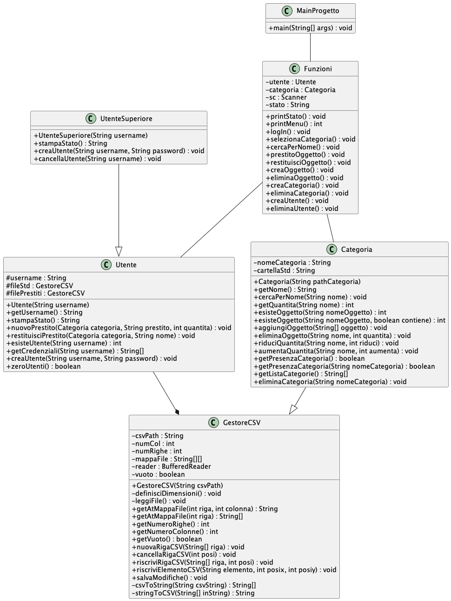

# Descrizione
Il progetto consiste in un’applicazione per la gestione degli oggetti di un laboratorio, come componenti elettronici, utensili da lavoro e strumenti di misura. La classe principale è Categoria, che gestisce correttamente gli oggetti suddivisi in diverse categorie, ovvero liste di oggetti. Queste liste sono salvate in formato CSV, permettendo anche la modifica tramite un foglio di calcolo. La lettura e la scrittura dei file CSV è affidata alla classe GestoreCSV, che conserva l’intero contenuto del file in un array di stringhe chiamato “mappa del file”, sul quale è possibile eseguire tutte le modifiche desiderate. Solo dopo la chiamata della funzione salvaModifiche(), i contenuti della mappa vengono scritti sul file.
Per l’utilizzo del programma sono previsti tre livelli di accesso: senza accesso, utente base e utente superiore. Senza effettuare l’accesso, è possibile esclusivamente cercare un oggetto in tutte le categorie. Con l’accesso base, oltre alla ricerca, è possibile selezionare una categoria specifica e prendere in prestito degli oggetti. Con l’accesso da utente superiore si possono creare e cancellare oggetti, categorie e utenti. La gestione degli utenti è affidata alla classe Utenti, mentre le funzionalità aggiuntive per l’utente superiore sono gestite dalla classe UtenteSuperiore.
L’interfaccia del programma consiste in un menu numerato su terminale, che consente una rapida selezione delle funzionalità tramite la digitazione di un numero. Tutte le funzioni sono racchiuse nella classe Funzioni, rendendo la classe MainProgetto più leggibile e ordinata.

# Diagramma delle classi:

# Diagramma di flusso: 

mermind
  A--B